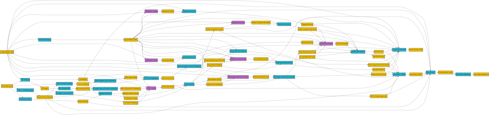

# Contributing to HELIOS

Thanks for helping build HELIOS! This repository is a **scaffold**: the runtime
seams (config, path resolution, IO, model base classes, the CLI, and the
stage/component wiring) are implemented and runnable on synthetic fixtures,
while the **per-component domain logic is stubbed** (`raise NotImplementedError`).
Your job as a contributor is usually to **fill in a stubbed component** with real
code ported from existing scripts/notebooks.

## The big picture



The pipeline is a bipartite DAG of **artifacts** (data on disk) and
**components** (pure functions that transform inputs into outputs). The diagram
above is the full graph; the authoritative source is
[`dev/notes/agent/pipeline-spec.yaml`](dev/notes/agent/pipeline-spec.yaml), and a
Graphviz version is at
[`dev/notes/agent/pipeline-workflow.dot`](dev/notes/agent/pipeline-workflow.dot).

[Tip: install the `tintinweb.graphviz-interactive-preview` VS Code extension to open and pan/zoom the `.dot` file directly in the editor.]

Operationally the pipeline is driven by a small CLI with four verbs:

```
helios prep    <noun>   # derive data artifacts (no model fitting)
helios fit     <noun>   # train models (loops all CV folds)
helios predict <noun>   # score cohorts with fitted models
helios report           # assemble per-case + cohort reports
```

## Setting up the repo

You need [`uv`](https://docs.astral.sh/uv/) (the only required tool — it manages
the Python toolchain and the virtualenv). Then:

```bash
make install        # uv sync: creates .venv, installs helios + dev tools
make shell          # open a sub-shell with the venv activated
make test           # run the suite (wiring runs end-to-end on synthetic fixtures)
make lint           # ruff (lint) + mypy (type-check)
make format         # auto-format + auto-fix with ruff
helios --help       # explore the CLI
```

Everything routes through the [`Makefile`](Makefile); run `make help` to list
targets. There is no need to `pip install` anything by hand — `uv` resolves and
installs from `pyproject.toml` into `.venv`. Because the package uses a
`src/` layout, it must be installed (editable) before `import helios` works;
`make install` does this for you.

Before opening a PR, make sure `make lint` and `make test` are green.

## Key modules of the `helios` package

The package lives under `src/helios/`. Three packages carry the contributor-facing
design; the rest are supporting infrastructure you mostly consume, not edit.

### `helios.components` — the pure logic (your workspace)

A **component** is a *pure function of its inputs*. It must **not** touch the
artifact store, the path resolver, or the run config. It takes typed arguments
(arrays, dataframes, or — for very large random-access artifacts — a resolved
`Path` to stream from) and returns typed outputs. Each component carries a
`GRAIN` note stating its unit of work (one image, a batch, a fold, an aggregate).
This is where almost all real domain code goes. One module per *noun* (domain
area): `thumbnails.py`, `tiling.py`, `features.py`, `cells.py`, `mil.py`,
`risk.py`, ...

### `helios.stages` — the orchestration (CLI-callable)

A **stage** is one `verb noun` cell (e.g. `prep thumbnails`, `fit mil`). Unlike
components, stages are **not** pure: they own all artifact-store I/O, the
dataset / partition / fold loops, per-unit skip logic (`--force`), selector
validation, and `Progress` wiring. A stage loads inputs from the store, calls
its component(s) once per work unit, and writes the outputs back.

- Modules are organised by noun; functions are named `verb_noun`
  (`prep_thumbnails`, `fit_mil`) so they grep cleanly and can be imported and
  called directly: `from helios.stages.thumbnails import prep_thumbnails`.
- [`stages/_runtime.py`](src/helios/stages/_runtime.py) holds the shared
  orchestration helpers every stage reuses (`cohort_store`, `folds_across`,
  `train_ids`, `model_folds`, `single_output_guard`, ...).
- [`stages/__init__.py`](src/helios/stages/__init__.py) holds the `STAGES`
  registry (`verb -> noun -> function`). A stage becomes reachable (CLI) and
  configurable (config introspection) the moment it is registered here.
- A stage's **keyword parameters with defaults are the single source of truth
  for its configuration** — see `helios.config` below.

### `helios.cli` — the command-line surface

Thin [Typer](https://typer.tiangolo.com/) wrappers, one module per verb
(`prep.py`, `fit.py`, `predict.py`, `main.py`). A CLI command resolves effective
parameters (defaults + `--config` + flags), builds a console `Progress`, and
calls the importable stage function. Shared flag parsing lives in
[`cli/_common.py`](src/helios/cli/_common.py). The CLI holds **no domain logic**.

### Supporting infrastructure

- **`helios.config`** — `code is the source of truth` for configuration.
  `introspect.py` reads each stage's signature to build the nested
  `{verb: {noun: {param: default}}}` mapping; `scripts/gen_configs.py`
  (`make configs`) serializes it to `configs/default.yaml`. `stage_config.py`
  resolves effective params with precedence *signature defaults < `--config` file
  < explicit CLI flags*. `column_mapping/` decouples a stage's logical column
  names from a cohort's physical CSV columns.
- **`helios.data`** — the storage layer. `dataset.py` (`Dataset`: lazily
  materializes a cohort root), `catalog.py` (loads `configs/artifacts.yaml`,
  the spec-derived artifact registry), `resolver.py` (artifact id + key →
  on-disk path), `io.py` (`ArtifactStore.read/write/exists/path` — the API stages
  use), `cohort.py` (the `--dataset` resolution layer, see below), and
  `bundle.py` (provenance-bearing model bundles).
- **`helios.models`** — `base.py` defines the tiny `fit`/`predict`/`save`/`load`
  `Model` contract plus a name registry (`@register_model`).
- **`helios.progress`** — the `Progress` object stages take (console output +
  `status.json` / `events.jsonl` reporting).
- **`helios.utils`** — small pure helpers (`partition.py` grid/fold expansion,
  `digests.py` content hashing). No domain logic.

## Implementing a component

The common task is bringing a **stubbed component to life**. Take thumbnail
extraction as a worked example — its component and stage already exist as stubs.

### 1. Fill in the component body

Open [`src/helios/components/thumbnails.py`](src/helios/components/thumbnails.py).
The stub already declares the exact contract — keep the signature and `GRAIN`
note, replace only the `raise NotImplementedError` with real logic:

```python
def extract_thumbnail(wsi_path: str, *, max_size: int = 2048) -> NDArray[np.uint8]:
    """Read a single slide and return a downsampled RGB thumbnail.

    GRAIN: one whole-slide image per call.
    """
    slide = openslide.OpenSlide(wsi_path)
    thumb = slide.get_thumbnail((max_size, max_size))
    return np.asarray(thumb.convert("RGB"), dtype=np.uint8)
```

Rules: stay pure (no store, no config, no disk paths except a passed-in WSI/large
artifact path), keep the signature and types intact, and honour the `GRAIN` note.
If a real dependency is needed (e.g. `openslide`), add it to `pyproject.toml` and
re-run `make install`.

### 2. Check the owning stage wires it correctly

The stage at [`src/helios/stages/thumbnails.py`](src/helios/stages/thumbnails.py)
owns the loop and the store I/O:

```python
for image_id in progress.task(ids, desc=f"thumbnails {Path(dataset).name}"):
    if not force and store.exists("thumbnail", image_id=image_id):
        continue
    thumb = extract_thumbnail(str(cohort.slides[image_id]), max_size=max_size)
    store.write("thumbnail", thumb, image_id=image_id)
```

Reads use `store.read(<artifact_id>, **keys)`, writes use
`store.write(<artifact_id>, obj, **keys)`, and the `**keys` must match the
artifact's `key` tuple in [`configs/artifacts.yaml`](configs/artifacts.yaml). For
very large random-access artifacts, pass `store.path(<id>, **keys)` to the
component so it can stream (see `fit_mil` for the pattern). A stage's tunable
parameters are plain keyword arguments with defaults — those defaults *are* the
config.

### 3. Test it

Mirror [`tests/test_stage_tile_features.py`](tests/test_stage_tile_features.py):
build a synthetic cohort with `tests/fixtures.py::make_cohort`, monkeypatch the
component to a deterministic stand-in, and assert the stage writes the expected
artifacts and respects skip / `--force`. Run `make lint && make test`.

### Adding a brand-new stage or artifact

If you are not filling a stub but adding a new component/stage from scratch:

1. **Declare any new artifacts** in
   [`dev/notes/agent/pipeline-spec.yaml`](dev/notes/agent/pipeline-spec.yaml)
   (id, `key`, `format`, `path`), then regenerate the registry:
   `uv run python scripts/gen_registries.py` (rewrites `configs/artifacts.yaml`
   and any diagrams). The spec is the source of truth — do not hand-edit the
   generated `artifacts.yaml`.
2. **Write the pure component** in `src/helios/components/<noun>.py`.
3. **Write the stage** in `src/helios/stages/<noun>.py` (`verb_noun` function),
   reusing the helpers in `stages/_runtime.py`.
4. **Register the stage** in `stages/__init__.py`'s `STAGES` map.
5. **Add the CLI command** in the matching `cli/<verb>.py` sub-app.
6. **Regenerate config**: `make configs` (picks up the stage's new keyword
   defaults into `configs/default.yaml`).
7. **Add a stage test** under `tests/`.

## Cohort definitions (`--dataset`)

Every verb accepts one or more `--dataset` values (repeatable or
comma-separated). The [`helios.data.cohort`](src/helios/data/cohort.py) layer
resolves each value into a list of `ResolvedDataset` (one physical root + an
optional pandas-`query` row filter). A `--dataset` value may be:

- a **plain root** (`--dataset /data/MGB`) — a single unfiltered cohort;
- a **cohort-definition file** (`--dataset cohorts/train.yaml`) — a named,
  version-controllable union of roots plus an optional filter:

  ```yaml
  # cohorts/train.yaml
  name: helios_train
  datasets:
    - /data/MGB
    - ../cohorts/MRV            # relative to this file
  filter: "path_stage in ['I', 'II']"   # optional, over image_metadata
  ```

Repeated `--dataset` flags union; the ad-hoc `--filter` flag (on `fit` /
`predict`) AND-combines onto each cohort's own filter. Stages always re-resolve
their `datasets` argument through `resolve_datasets()` (idempotent), then loop
`for ds in resolved:` using `ds.root`, `ds.where`, `ds.name`, and `ds.dataset()`.
Result tables carry a `dataset` provenance column (`ds.name`) so cross-cohort
concatenations stay lossless — strip it with `drop_provenance()` before feeding a
table back in as model features. When writing a new stage, take
`datasets: DatasetArgs` and follow this pattern (see `stages/_runtime.py`'s
`select_image_ids` / `train_ids(where=...)`).

## Conventions

- **No data, paths, or PHI in commits.** `var/`, `data/`, and model outputs are
  gitignored; shipped configs carry safe defaults only (no real cohort paths).
- **Code is the source of truth for config.** Never hand-edit
  `configs/default.yaml` or `configs/artifacts.yaml`; change the stage signature
  / pipeline spec and regenerate (`make configs` / `gen_registries.py`).
- **Keep components pure.** Store/resolver/config access belongs to stages only.
- The package is fully typed (`mypy` runs in `make lint`); add type hints to all
  new code, and keep `from __future__ import annotations` at the top of modules.
- Keep changes surgical and scoped to the component(s)/stage(s) you own.
