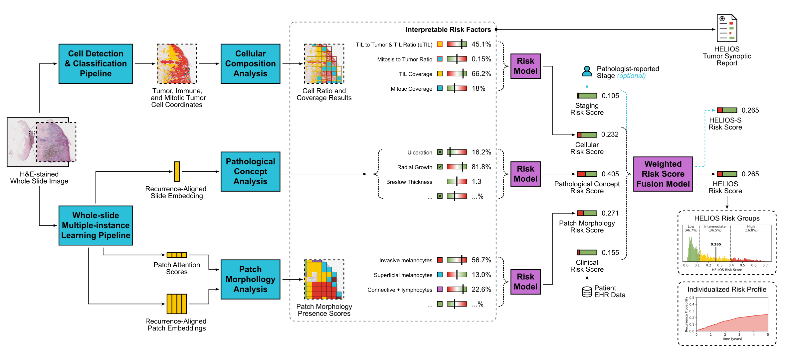

# HELIOS

End-to-end computational-pathology pipeline that predicts melanoma recurrence
risk from H&E whole-slide images (WSIs).



HELIOS (**H**ematoxylin & **E**osin-based **L**esion **I**nformed **O**utcome
**S**core) turns a routine H&E slide into a transparent, biologically grounded
recurrence-risk assessment. Instead of a single black-box number, it routes each
slide through parallel, individually interpretable branches and fuses them into
one continuous risk score that a pathologist can audit factor by factor.
Developed and validated across 2,860 early-stage patients on three continents, it
outperformed AJCC staging in every external cohort while staying interpretable by
design.

This repository is the open-source framework: a modular, config-driven,
reproducible pipeline so the community can extend each branch, swap in new
foundation models, validate on new cohorts, and build clinically deployable,
explainable risk tools on a shared foundation.

> **Status: scaffold.** The runtime seams — config, path resolution, IO, model
> base classes, stage/component wiring, and the CLI — are implemented and
> runnable on synthetic fixtures. The per-component **domain logic is stubbed**
> (`raise NotImplementedError`); this is the surface to port existing
> script/notebook code into. See [CONTRIBUTING.md](CONTRIBUTING.md).

## Why HELIOS

One score, decomposable into the evidence behind it. Each slide is scored by five
parallel branches, each interpretable on its own:

- **Whole-slide representation** — attention-based multiple-instance learning
  (A-MIL) over foundation-model tile features, with the attention map showing
  *where* the model looked.
- **Cellular composition** — quantitative cell detection, classification, and
  mitosis counting aggregated into per-slide features.
- **Pathological concepts** — linear probes that decode human-readable concepts
  (thickness, ulceration, mitoses, growth pattern, …) from the slide embedding.
- **Patch morphology** — unsupervised clustering of high-attention regions into
  recurring morphological phenotypes whose presence carries risk.
- **Clinical staging** — the structured clinical and AJCC-staging signal.

A small, transparent fusion model (logistic regression / random forest) combines
the branch scores into the final HELIOS risk, so every prediction can be traced
back to the factors that drove it.

## Quickstart

```bash
make install        # uv sync: creates .venv, installs helios + dev tools
make shell          # open a sub-shell with the venv activated
make test           # end-to-end smoke run of the pipeline on synthetic fixtures
make lint           # ruff + mypy
helios --help       # browse the full command tree
```

`make test` runs the whole prep → fit → predict → report flow on a synthetic
cohort (no real data required), so you can confirm the wiring works before
touching a slide.

### The four verbs

HELIOS is driven by a small CLI with four verbs you run in order:

```
helios prep    <noun>   # derive data artifacts (tiles, features, cells, splits)
helios fit     <noun>   # train models (loops all CV folds)
helios predict <noun>   # score cohorts with the fitted models
helios report           # assemble per-case + cohort reports
```

A first end-to-end run against a single cohort looks like:

```bash
helios prep --dataset /data/my_cohort        # run every prep stage in order
helios fit  mil       --dataset /data/my_cohort
helios predict mil    --dataset /data/my_cohort
helios fit  risk      --dataset /data/my_cohort
helios predict risk   --dataset /data/my_cohort
helios report --dataset /data/my_cohort
```

### Assembling a cohort

A cohort is just a directory with the slides and a metadata table:

```
my_cohort/
  wsi/                                  # one slide per image_id
    DEMO-SKCM-P00001-S01-B1-I1.svs      # .svs / .tiff / .tif / .ndpi
    DEMO-SKCM-P00002-S01-B1-I1.svs
    ...
  metadata/
    image_metadata.csv                  # one row per image_id
```

`image_metadata.csv` needs, at minimum:

- **`image_id`** — matches the WSI filename stem (e.g.
  `DEMO-SKCM-P00001-S01-B1-I1`).
- **Tiling fields** — `image_mpp`, `image_width`, `image_height`,
  `image_magnification`.
- **`patient_id`** — the cross-validation grouping key (splits are patient-level
  to prevent leakage).
- **Branch labels** — only for the branches you actually train: recurrence
  targets (`disease_pfs_recurred*`), pathological concepts (`path_thickness`,
  `path_ulceration_present`, …), staging (`path_stage*`), and clinical
  (`patient_sex`, `disease_age_at_diagnosis`, …).

You don't hard-code these names. They're **bound** in
[`configs/column_mapping/default.yaml`](configs/column_mapping/default.yaml) and
validated against the versioned data dictionary
[`configs/schema/image_metadata.datadict.yaml`](configs/schema/image_metadata.datadict.yaml),
which is the full column reference. A cohort whose columns are named differently
just needs a remapped YAML — no code changes. For a minimal, runnable example,
see [`tests/fixtures.py`](tests/fixtures.py) (`make_cohort`).

## The pipeline at a glance

The CLI surface is 16 commands across the four verbs. The whole tree is
browsable live with `helios --help` (and `helios <verb> --help`,
`helios <verb> <noun> --help`):

| Verb | Nouns |
| --- | --- |
| `prep` | `splits`, `thumbnails`, `tiles`, `augment`, `tile-features`, `cells`, `cell-features` |
| `fit` | `mil`, `concept`, `morphology`, `risk` |
| `predict` | `mil`, `concept`, `morphology`, `risk` |
| `report` | *(single command)* |

Bare `helios prep --dataset ...` runs every prep noun in order — handy for
prepping a fresh cohort end-to-end.

Under the hood the package is organized in three layers:

- **`helios.components`** — pure functions, one per unit of domain logic (the
  code you fill in).
- **`helios.stages`** — CLI-callable orchestrators that own all store IO and the
  dataset / partition / fold loops (one `verb noun` cell each).
- **`helios.cli`** — thin Typer wrappers that resolve config and wire progress.

See [CONTRIBUTING.md](CONTRIBUTING.md) for the full module tour and how the
artifact spec drives the graph.

## Working with HELIOS

### Workspace & output layout

By default, derived artifacts (tiles, features, models, predictions, reports) are
written back under the cohort root, so a cohort directory becomes the
self-contained record of everything computed from it. To keep source data
read-only, redirect derived outputs elsewhere with `--output-root`:

```bash
helios prep --dataset /data/my_cohort --output-root /scratch/runs/my_cohort
```

The source cohort is never written to; everything derived lands under the run
root instead. (`--output-root` targets a single `--dataset` at a time.)

### Named, versioned cohorts

Every command accepts one or more `--dataset` values. A value can be a plain
cohort root, or a **cohort-definition file** — a small, version-controllable YAML
that names a union of roots plus an optional row filter:

```yaml
# cohorts/train.yaml
name: helios_train
datasets:
  - /data/MGB
  - ../cohorts/MRV                      # relative paths resolve against this file
filter: "path_stage in ['I', 'II']"     # optional pandas-query over image_metadata
```

```bash
helios fit mil --dataset cohorts/train.yaml
```

This makes training and evaluation populations reproducible and reviewable. You
can also:

- **Union on the fly** — repeat `--dataset` (or comma-separate) to pool several
  cohorts: `--dataset /data/MGB --dataset /data/MRV`.
- **Filter ad hoc** — add `--filter "patient_age_at_diagnosis > 60"` on `fit` /
  `predict`; it's AND-combined with any cohort-file filter.
- **Trace provenance** — result tables carry a `dataset` column recording which
  physical cohort each row came from, so pooled outputs stay lossless.

### Cross-validation folds

Cross-validation is optional and driven by a `cv_splits` table (produced by
`helios prep splits`), which assigns each `image_id` to a fold and train/test
split. With splits present, `fit` trains **one model per fold** in a single
invocation, and `predict` reduces the per-fold scores out-of-fold on the CV
cohort. With no `cv_splits`, the same code path trains a single fold-free model
and ensembles at inference — exactly what you want when deploying to a fresh
cohort. Splits are grouped by `patient_id` so a patient's slides never straddle
the train/test boundary.

### Configuration

Every tunable parameter has a default declared in code (the stage's keyword
arguments), so the configuration and the CLI can never drift. Those defaults are
introspected into [`configs/default.yaml`](configs/default.yaml); regenerate it
with `make configs` after changing a default. At run time, values resolve with
clear precedence:

```
signature defaults  <  --config file  <  explicit CLI flags
```

Pass a partial override file with `--config my_run.yaml` to change a handful of
parameters without restating the rest. Configs hold parameters only — never data
paths or PHI.

## Contributing

HELIOS is built to be extended: each branch is a pluggable, independently
testable component, and most contributions are filling a stubbed component with
real code.

```bash
git clone <repo-url> && cd helios
make install
make lint && make test          # confirm a green baseline
grep -rn "NotImplementedError" src/helios/components   # find a stub to implement
```

Then read [CONTRIBUTING.md](CONTRIBUTING.md) for the component contract, the
worked thumbnail example, and how to add a brand-new stage or artifact.
